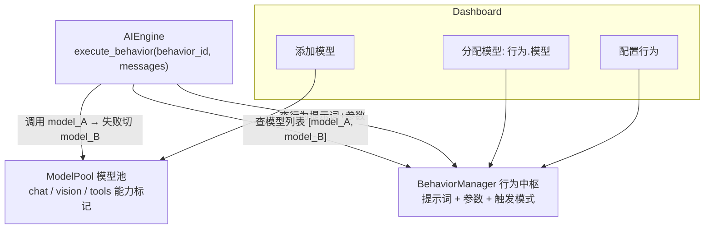
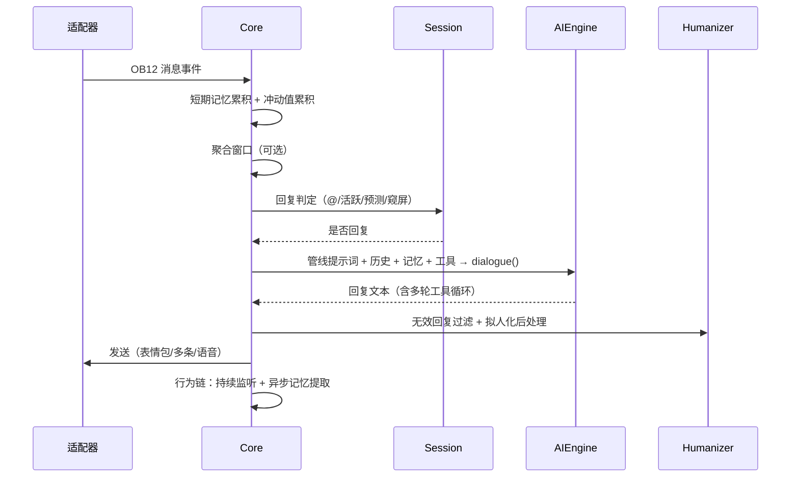

# QvQChat 架构文档

技术架构与模块职责说明。使用与配置说明见 [README](README.md)。

## 包结构

```
QvQChat/
├── Core.py                  # Main 主编排器：消息入口 → 回复判定 → 生成 → 发送 → 行为链
├── config.py                # QvQConfig 配置包装器 + QvQConfigData 声明式配置
├── I18n.py                  # 多语言键定义
├── utils.py                 # MessageSender 多消息发送器 + 通用工具函数
│
├── ai/                      # AI 引擎子系统
│   ├── engine.py            # AIEngine: 行为执行引擎（故障转移）
│   ├── client.py            # AIClient: 单模型 OpenAI 兼容客户端
│   ├── model_pool.py        # ModelPool: 模型池（chat/vision/tools 能力标记）
│   └── behavior.py          # BehaviorManager: 行为中枢（提示词+模型分配+触发模式）
│
├── chat/                    # 对话处理子系统
│   ├── memory.py            # 兼容垫片：QvQMemory → memory.MemoryManager
│   ├── session.py           # SessionManager: 会话状态（速率限制/活跃模式/冲动值/冷却计数）
│   ├── sticker.py           # StickerManager: 表情包
│   ├── humanize.py          # Humanizer: 拟人化后处理（延迟/错字/半句/已读不回/回复检测）
│   └── proactive.py         # ProactiveManager: 主动发起编排（冲动值门槛检查+发送）
│
├── pipeline/                # 提示词注入管线
│   ├── base.py              # Injector / PromptContext / PromptPipeline
│   ├── injectors.py         # 9 个内置注入器
│   └── time_narrator.py     # TimeNarrator: AI 时间叙述（按小时缓存）
│
├── memory/                  # 记忆子系统
│   ├── manager.py           # MemoryManager: 记忆门面（历史+提取+检索）
│   ├── store.py             # MemoryStore: SQLite 持久化
│   ├── extractor.py         # MemoryExtractor: 提取编排
│   ├── retriever.py         # 按相关性检索
│   └── intent.py            # 记忆操作意图解析（记住/忘记）
│
├── agent/                   # 智能体管理子系统
│   ├── multi.py             # MultiAgentManager: 多智能体人格
│   ├── knowledge.py         # KnowledgeBase: 知识文档注入
│   ├── tools.py             # MCPManager: MCP 工具管理
│   └── mcp_client.py        # 单个 MCP 服务器客户端（stdio/HTTP）
│
└── dashboard/               # Dashboard 管理子系统
    ├── manager.py           # DashboardManager: 路由注册 + 视窗注册 + API 处理器
    ├── icons.py             # SVG 图标常量
    ├── styles.py            # CSS 样式
    ├── html.py              # 页面 HTML
    └── scripts.py           # JavaScript（全部 CRUD 逻辑）
```

## 核心设计：模型池 + 行为绑定



**模型**有 3 种能力标记：

| 能力 | 说明 |
|------|------|
| `chat` | 文本对话 |
| `vision` | 图片识别 |
| `tools` | 函数调用 |

**行为**内置 7 种，支持自定义：

| 行为 | 类型 | 能力 | 职责 |
|------|------|------|------|
| `dialogue` | AI | chat | 核心对话，生成自然回复 |
| `reply_judge` | AI | chat | 回复判定，支持预测模式 |
| `memory` | AI | chat | 长期记忆提取 |
| `intent` | AI | chat | 消息意图识别 |
| `vision` | AI | vision | 图片分析 |
| `time_aware` | 场景 | — | 时间段风格提示词 |
| `mood_aware` | 场景 | — | 情绪感知风格提示词 |

AI 行为启动时自动分配兼容模型；内置行为提示词随版本升级自动同步（`_upgrade_prompts`），已自定义的参数（温度/上限）不被覆盖。

## 消息处理流程



详细的判定层级：

```
_check_should_reply()
  ├─ 私聊 → 始终回复
  ├─ 被@/叫名字 → 直接回复
  ├─ 活跃模式 → 直接回复
  ├─ 夜间模式 → 夜间强制窥屏
  ├─ 预测模式（低token）→ 累积N条 → AI预测词 → 匹配触发词
  └─ 标准模式 → 窥屏概率 + AI 判断
```

## 主动发起对话（冲动值驱动）

每条来消息按内容加权累积会话冲动值（基础 0.06；提问 +0.12；感叹号 +0.05；长消息 +0.04），按 2 小时半衰期衰减。检查循环（间隔抖动 ±50%）在以下门槛全部满足时触发发送：

1. 睡眠作息（`sleep_schedule` 启用时睡眠时段跳过）
2. 全局每日上限（`global_max_per_day`，默认 3）
3. 沉寂门槛（`min_silence_hours`，默认 6h）
4. 冲动值 ≥ `urge_threshold`（默认 1.0）
5. 单会话每日上限（`max_per_day`，默认 1）
6. 未回复冷却（上次主动发起未被回复时跳过）

状态与编排分离：冲动值/计数/冷却时间戳由 `SessionManager` 维护，门槛检查与发送由 `ProactiveManager` 编排。AI 保留否决权——输出 `(沉默)` 时冲动值减半，避免下一轮检查立即重复触发。

## 提示词注入管线

9 个内置注入器按 priority 升序构建系统提示词：

```
Identity(10) → Rule(20) → Scene(30) → Knowledge(50)
→ Time(60) → Mood(70) → Tool(80) → Voice(90) → Proactive(100)
```

- 记忆上下文由 `Core._build_memory_context` 按当前消息相关性检索后作为独立 system 消息注入
- 时间叙述按 `pipeline.time_inject_probability`（默认 0.7）概率注入，按小时缓存

## 预测模式（低 token 模式）

```
群聊消息1 → 缓冲[1/5]
群聊消息2 → 缓冲[2/5]
群聊消息3 → 缓冲[3/5]
群聊消息4 → 缓冲[4/5]
群聊消息5 → 缓冲[5/5] → 触发预测
  ├─ 批量消息 → reply_judge 行为
  ├─ AI 返回: "回复" → 进入对话流程
  └─ AI 返回: "跳过" → 不回复，清空缓冲
```

行为可配置：

- `trigger_mode: "prediction"` — 启用预测模式
- `prediction_interval: 5` — 每 5 条消息触发一次
- `trigger_words: ["回复","参与"]` — 命中才进入对话

## 记忆系统

```
对话历史（短期） ──→ 记忆提取行为 ──→ 长期记忆
                                  │
                    ┌─────────────┼─────────────┐
                    ▼             ▼             ▼
              用户长期记忆    群组发送者记忆   群共享上下文
```

- 仅在机器人回复后异步提取（不在观察时提取），无记忆价值的消息（纯数字/单字/表情/噪音词）跳过
- 会话级并发锁防止重复提取
- 单个工具/记忆结果按上限截断，防止上下文膨胀
- 群聊支持 mixed/sender_only 两种记忆模式

## Dashboard API

| 路由 | 方法 | 说明 |
|------|------|------|
| `/api/status` | GET | 系统概览 |
| `/api/config` | GET/POST | 基础配置 |
| `/api/models` | GET/POST | 模型 CRUD |
| `/api/models/delete` | POST | 删除模型 |
| `/api/behaviors` | GET/POST | 行为 CRUD |
| `/api/behaviors/delete` | POST | 删除行为 |
| `/api/test-model` | POST | 测试模型连接 |
| `/api/agents` | GET/POST | 智能体 CRUD |
| `/api/agents/delete` | POST | 删除智能体 |
| `/api/knowledge` | GET/POST | 知识库 CRUD |
| `/api/knowledge/delete` | POST | 删除知识 |
| `/api/tools` | GET/POST | MCP 工具 CRUD |
| `/api/tools/delete` | POST | 删除工具 |
| `/api/groups` | GET/POST | 群组管理 |
