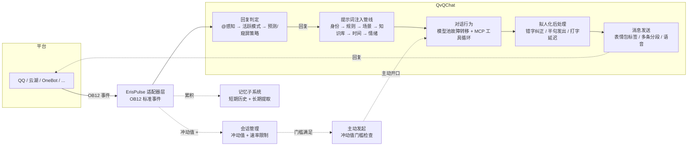

<div align="center">


# QvQChat

**让 AI 像真人一样参与群聊。**

<p>
  <a href="https://pypi.org/project/ErisPulse-QvQChat/"></a>
  <a href="https://pypi.org/project/ErisPulse-QvQChat/"></a>
  <a href="https://github.com/wsu2059q/ErisPulse-QvQChat/pkgs/container/erispulse-qvqchat"></a>
  <a href="./LICENSE"></a>
  <a href="https://github.com/ErisPulse/ErisPulse"></a>
</p>

</div>

---

基于 [ErisPulse](https://github.com/ErisPulse/ErisPulse) 的智能对话模块。多模型池 + 行为绑定 + 多智能体人格 + 长期记忆 + 知识库 + MCP 工具，配合全功能 Dashboard 管理面板——适配器、模型、行为配置全部可视化完成。

<div align="center">

### 核心特性

</div>

<table>
<tr>
<td width="33%" align="center" valign="top">

### 👀 会窥屏

群聊中默默观察，只在被 @、有人叫名字或话题相关时才开口。预测模式（低 token）批量判断是否参与，不抢话、不刷屏

</td>
<td width="33%" align="center" valign="top">

### 🕐 有生活感

打字延迟随回复长短变化、清晨迷糊深夜放得开、错字后自己纠正、偶尔半句发出——像真人一样不完美

</td>
<td width="33%" align="center" valign="top">

### 💬 主动搭话

冲动值驱动：聊天越热闹越想开口；睡觉时段不打扰、没人理就冷却；没有真正想说的就保持沉默

</td>
</tr>
<tr>
<td width="33%" align="center" valign="top">

### 🧠 模型池 + 行为绑定

任意 OpenAI 兼容 API 汇入模型池，按能力标记（chat/vision/tools），多模型冗余故障自动切换，行为级独立分配

</td>
<td width="33%" align="center" valign="top">

### 📝 会记忆

回复后自动提取长期记忆，群聊支持混合/仅发送者两种模式，下次聊天自然提起

</td>
<td width="33%" align="center" valign="top">

### 🖥️ 全功能 Dashboard

21 个 API 的 Web 管理面板：模型、行为、智能体、知识库、表情包、配置即时生效，无需手动编辑文件

</td>
</tr>
</table>

---

## 工作原理

一条消息从进入到回复的完整处理链：



---

## Dashboard

所有配置一站式完成，修改即时生效。


<table>
<tr>
<td width="50%" align="center" valign="top">

**行为管理 — 自由定制 AI 人格**

内置 7 种行为 + 自定义行为，独立配置提示词、模型、温度。


</td>
<td width="50%" align="center" valign="top">

**基础设置 + 表情包**

窥屏/速率/拟人化参数一目了然；自定义表情包由 AI 按场景自主发送。


</td>
</tr>
</table>


---

## 功能一览

| 模块 | 说明 |
|------|------|
| 🧠 模型池 | 多模型管理，能力标记（对话/视觉/工具调用），故障自动切换 |
| 🎭 行为系统 | 自定义行为、独立提示词、模型分配、触发模式（始终/预测） |
| 👥 多智能体 | 猫娘/傲娇/温柔大姐姐等人格模板，按群/用户绑定 |
| 👀 窥屏模式 | 群聊默认观察，被 @ / 叫名字 / 活跃模式时才回复 |
| 🔮 预测模式 | 低 token：累积 N 条消息批量判断，命中触发词才进入对话 |
| 🕐 拟人化 | 打字延迟、时间感知、情绪感知、错字纠正、半句发出、多条消息 |
| 💬 主动搭话 | 冲动值驱动，睡眠不打扰、没人理就冷却、宁可沉默不尬聊 |
| 📝 记忆系统 | 自动提取长期记忆，群聊支持混合/仅发送者两种模式 |
| 📚 知识库 | 文档注入对话上下文，支持分类、标签、自动搜索 |
| 🔧 MCP 工具 | 函数调用，让 AI 调用外部 API |
| 🎙️ 语音合成 | `<\|voice style="语气"\|>` 语音标签，CosyVoice2 合成 |
| 🖥️ Dashboard | 全功能 Web 面板，所有配置即时生效 |

---

## 快速开始

### Docker（推荐）

```bash
docker run -d --name qvqchat -p 8000:8000 --restart unless-stopped ghcr.io/wsu2059q/erispulse-qvqchat:latest
```

启动后打开 `http://localhost:8000/Dashboard`，适配器、AI 模型、行为配置全部在面板中完成。

<details>
<summary>使用 pip 安装</summary>

```bash
pip install ErisPulse
pip install ErisPulse-QvQChat
ep run
```

</details>

### 初始配置

1. Dashboard 中添加适配器（如 [YunhuAdapter](https://github.com/ErisPulse/ErisPulse-YunhuAdapter)、[OneBot11Adapter](https://github.com/ErisPulse/ErisPulse-OneBot11Adapter)）
2. 添加 AI 模型（OpenAI / DeepSeek / SiliconFlow 等任意兼容 API），标记能力
3. 在行为管理中为各行为分配模型——完成，开始聊天

---

## 文档

- [安装指南](INSTALL.md)
- [架构文档](ARCHITECTURE.md)
- [ErisPulse 框架文档](https://www.erisdev.com)

---

<div align="center">

**许可证**

本项目基于 [MIT License](./LICENSE) 开源。

驱动于 [ErisPulse](https://github.com/ErisPulse/ErisPulse) —— 一次编写，部署到多个聊天平台。

</div>
